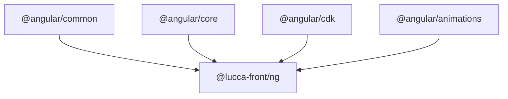

[](https://miguell.lucca.tech/projects/byDependency?name=@lucca-front/ng)

# Lucca Front

Lucca Front is a modular framework for developing web applications by [lucca](http://www.lucca.fr).
It uses sub-packages architecture with unified versioning, à la [angular](https://github.com/angular/angular).

## Lucca Front contains 4 packages

- a set of icons [@lucca-front/icons](packages/icons/README.md)
- a SCSS framework [@lucca-front/scss](packages/scss/README.md)
- a library of lucca components [@lucca-front/ng](packages/ng/README.md)
- a library of design system components [@lucca-front/prisme](packages/prisme/README.md)

Angular package depends on the SCSS one which depends itself on Icons.

### Why Ng and Prisme packages ?

Historically, `@lucca-front/ng` contained both Design System components (Prisme) and Lucca specific business components. This created maintenance challenges as the Design System team needed to maintain atomic/molecular components while business units maintained domain-specific components (like `department-select`).

To solve this separation of concerns:
- **`@lucca-front/prisme`** contains pure Design System components (atomic, molecular), maintained by the Design System team. This package is Open Source, promoting transparency and sharing.
- **`@lucca-front/ng`** contains Lucca business components and domain-specific logic (API interactions, business data display), maintained by the respective business units. This package contains proprietary business logic.

This split ensures clear ownership, better maintenance, and respects the Open Source philosophy for the Design System while keeping business logic internal.

[Full Split LF/Prisme documentation](https://www.notion.so/D-coupe-LF-Prisme-058d096867ed460bb57681d82e5a097c?source=copy_link)
[Distribution of LF/Prisme components](https://www.notion.so/120d278ab26e8009825cf8879bb0b2e6?v=121d278ab26e80d98405000ca486e14a&source=copy_link)

## How to install

### Add Lucca Front to your npm package

```
npm install @lucca-front/icons --save
npm install @lucca-front/scss --save
npm install @lucca-front/ng --save
npm install @lucca-front/prisme --save
```

### Import packages styles

In your file styles.scss, add imports files and components you want to import to your project.

#### Basic setup

```
// Import core styles (required)
@forward '@lucca-front/icons/src/main';
@forward '@lucca-front/scss/src/main';
@forward '@lucca-front/ng/src/main';
```

#### Available SCSS components

For the complete list of available SCSS components organized by category, see the [SCSS package documentation](packages/scss/README.md).

#### Import all components (not recommended)

To import all components at once:

```
// Import styles
@forward '@lucca-front/icons/src/main';
@forward '@lucca-front/scss/src/main-all';
@forward '@lucca-front/ng/src/main';
```

For custom imports, check our [advanced usage documentation](https://prisme.lucca.io/94310e217/p/950783-chargement-des-composants).

### Include paths

In angular.json, we suggest to add a couple of entries to your paths:

```
"architect": {
  "build": {
    "options": {
      "stylePreprocessorOptions": {
        "includePaths": [
          "src/scss",
          "node_modules"
        ]
      },
    },
  },
},
```

## How to update

In order to activate schematics when they are available, we recommend to update Lucca Front using this command line:

```
lucca angular update
```

To check available options:

```
lucca angular update --help
```

To update a specific version of Lucca Front (@ points either to a specific version or a npm release channel):

```
npx ng update @lucca-front/ng@16.5.0
```

For release:

```
npx ng update @lucca-front/ng@rc
```

If you want the latest version you can run this equivalent functions:

```
npx ng update @lucca-front/ng
```

or

```
npx ng update @lucca-front/ng@latest
```

## Storybook

In order to work on Lucca Front, we use Storybook to display components.

- Install [volta.sh](https://docs.volta.sh/guide/getting-started)
- Install node `volta install node@lts`
- Run storybook `npm start`

## Translations

### How it works

Translations are hosted by Lokalise on `Lucca.Front` project and must be imported by launching the command at project root: `npm run i18n:update`.
[Full translations documentation](https://www.notion.so/Lucca-Front-Traductions-Lokalise-173d278ab26e801b8462f90e1a93dd50)

### Overrides

Many Lucca Front components support translation overrides through the `[intl]` input. This allows you to customize specific translations without modifying the default translation files.

Components use the `intlInputOptions()` function to create an `intl` input that:
1. Automatically loads translations based on the current locale (`LOCALE_ID`)
2. Accepts an object with partial translations to override specific keys
3. Merges your custom translations with the default ones

#### Example with Pagination Component

**Override multiple keys**:
```html
<lu-pagination 
  [from]="0" 
  [to]="10" 
  [itemsCount]="100" 
  [intl]="{
    results: 'Page {{from}}-{{to}} / {{itemsCount}}',
    previous: 'Prev',
    next: 'Next',
    results: 'Showing {{from}} to {{to}} of {{itemsCount}} items'
  }" 
/>
```

## Compatibility Table

| Angular | @lucca-front/ng | @lucca/prisme | Note |
| ------- | --------------- | ------------- | ---- |
| 21.0    | 21.x            | 21.x          | Current version |
| 20.0    | 20.4+           | 20.4+         | Support for Angular 20 & 21 since v20.4.0 |
| 19.0    | 19.x            | -             | Angular 19 only |
| 18.0    | 18.x            | -             | Angular 18 only |
| 17.0    | 17.x            | -             | Angular 17 only |
| 16.0    | 16.x            | -             | Angular 16 only |

**Important notes:**  
- Lucca Front follows the same major version as Angular (v21.x for Angular 21, v20.x for Angular 20, etc.)

[Lucca Front et SemVer](https://www.notion.so/Lucca-Front-et-SemVer-27ad278ab26e802ca4dacd9bea53d648?source=copy_link)

## Dépendances

### @lucca-front/ng



## License
The source code of this project is distributed under the Apache 2.0 license (see the LICENSE file). 

Please note:
Assets (including but not limited to images, audio files, fonts, icons, trademarks, logos, brand names and other media files) included in this repository are NOT covered by this license. They remain the property of their respective owners and their use is subject to specific restrictions. Please respect these conditions.
